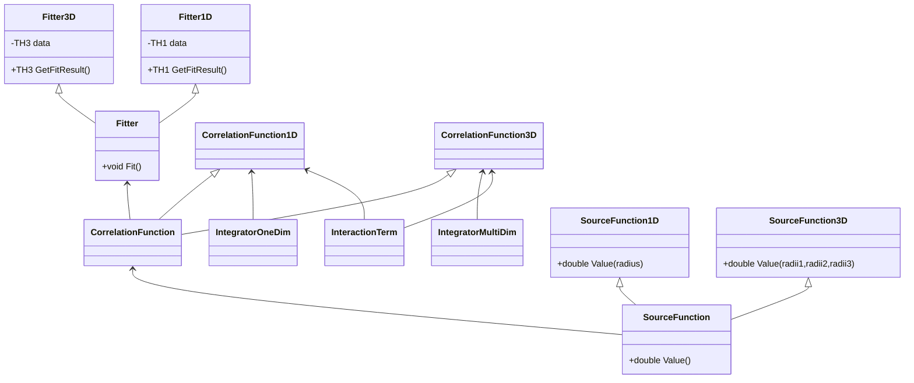
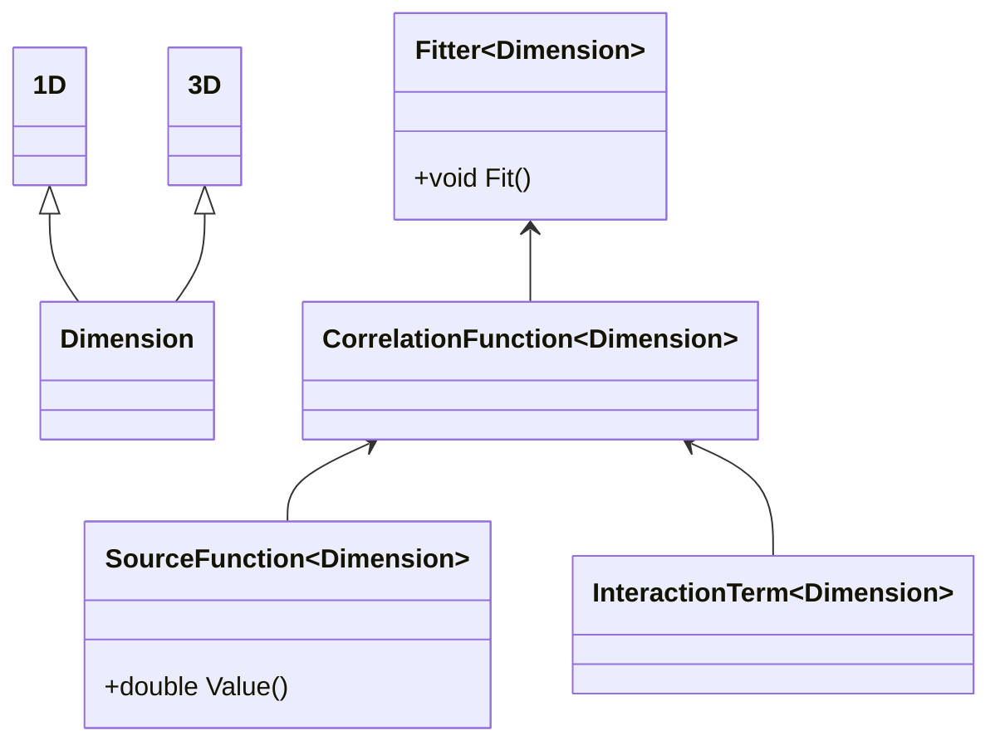

# JJCorrFitter
Correlation function fitting library

## Idea 1 - Inheritance Based

```mermaid

classDiagram
    Fitter1D <|-- Fitter
    Fitter3D <|-- Fitter
    CorrelationFunction <-- SourceFunction
    CorrelationFunction1D <-- InteractionTerm
    CorrelationFunction3D <-- InteractionTerm
    CorrelationFunction1D <-- IntegratorOneDim
    CorrelationFunction3D <-- IntegratorMultiDim
    CorrelationFunction1D <|-- CorrelationFunction
    CorrelationFunction3D <|-- CorrelationFunction
    Fitter <-- CorrelationFunction
    SourceFunction1D <|-- SourceFunction
    SourceFunction3D <|-- SourceFunction
    class Fitter{
        +void Fit()
    }
    class Fitter1D{
        -TH1 data
        +TH1 GetFitResult()
    }
    class Fitter3D{
        -TH3 data
        +TH3 GetFitResult()
    }
    class SourceFunction{
        +double Value()
    }
    class SourceFunction1D{
        +double Value(radius)
    }
    class SourceFunction3D{
        +double Value(radii1,radii2,radii3)
    }
    class CorrelationFunction{
    }
    class CorrelationFunction1D{
    }
    class CorrelationFunction3D{
    }
    class InteractionTerm{
    }

```

## Idea 2 - Template Based

```mermaid
classDiagram

    1D <|-- Dimension
    3D <|-- Dimension
    Fitter~Dimension~ <-- CorrelationFunction~Dimension~
    CorrelationFunction~Dimension~ <-- SourceFunction~Dimension~
    CorrelationFunction~Dimension~ <-- InteractionTerm~Dimension~

    class Dimension{
    }
    class 1D{
    }
    class 3D{
    }
    class Fitter{
        +void Fit()
    }
    class SourceFunction{
        +double Value()
    }
    class CorrelationFunction{
    }
    class InteractionTerm{
    }
```